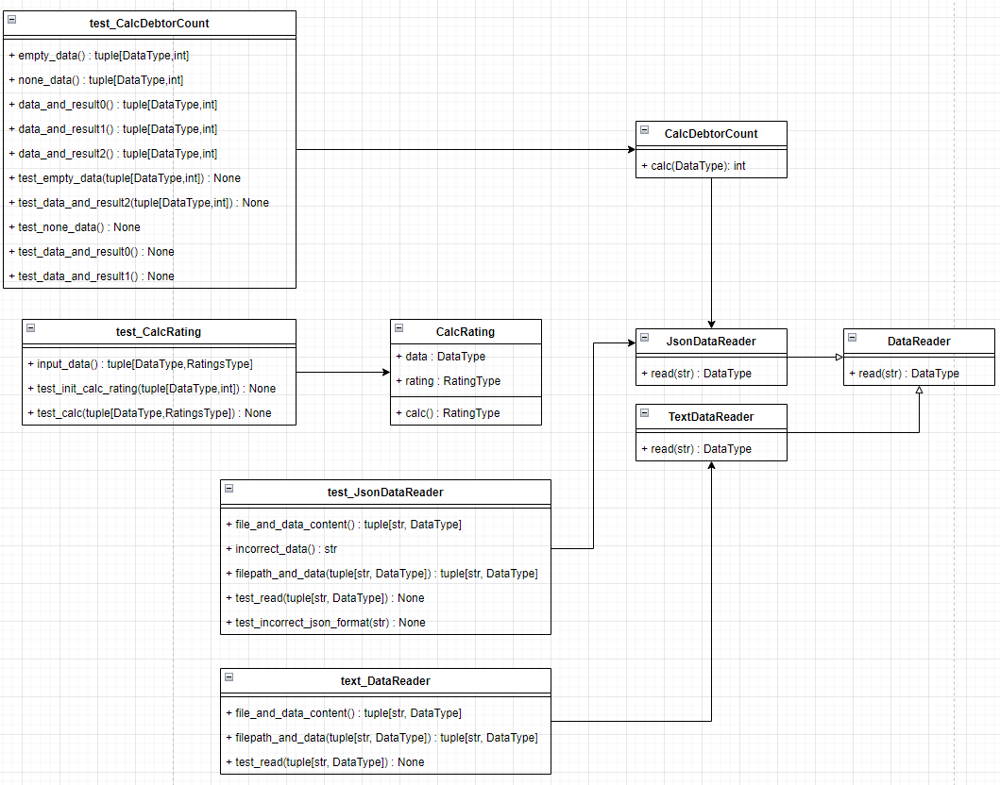

# Лабораторная работа 1 по дисциплине "Технологии программирования"

---

## Постановка здачи:
* Вариант задачи: 4
* Текстовый формат: JSON
* Рассчитать и вывести на экран количество студентов,
имеющих академические задолженности (имеющих балл
< 61 хотя бы по одному предмету).
* Создать тесты покрывающие максимальный объем разработанных классов

## Технологический стек:
 * Python 3.9 (require  3.10 for actions)
 * pytest 7.1.13
 * pycodestyle 2.9.1
  
Все требуемые пакеты также указаны в файле requirements.txt

## Пример входных данных:
Формат данных JSON
    data/data.json
```
{
  "Иванов Иван Иванович" :
  [
    {"математика":80},
    {"программирование": 90},
    {"литература": 76}
  ],
  "Петров Петр Петрович" :
  [
    {"математика": 100},
    {"программирование": 90},
    {"литература":61}
  ]
}
```

Диаграмма классов UML:
